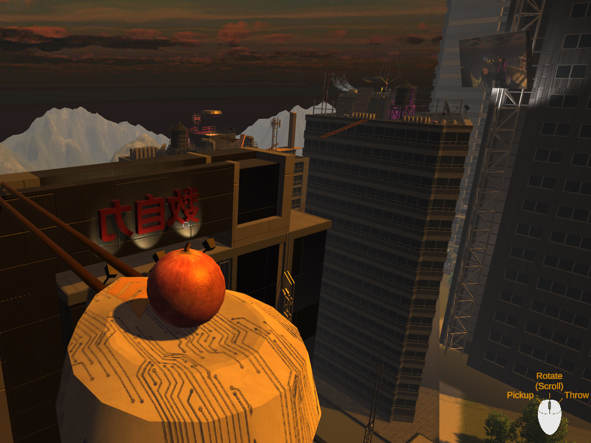

<h1>Roller Ball Escape!</h1>
These are scriptes that I developed for use in my game Roller Ball Escape.  
The final project for 3D Simulation class at CVTC was to develop and design a game in Unity. 

Below is my version of Roller Ball Escape!

Also feel free to play a web version here: <a href="https://cvtc.devsketch.com/unity/RollerBallEscape_Web_LowQuality/">Play Roller Ball Escape!</a>

Click in the window to control the mouse inside the window.  Press TILDE (~) to escape out of the window to get your mouse back.

<h3>Level 1: The Beginning</h3>

This was the very first level for class.  Although the course is short, I made sure to still include a little challenge for getting the best time or an alternate route if you didn't make the jump.

<h3>Level 2: The Drop</h3>

This level was where I had a lot of fun designing the bridge in Blender and getting the floor to drop out on you.  This is also a shorter level, but I was able to add more realism to the environment, as well as a toggle to turn on evening mode that includes music and fancy lighting.

<h3>Level 3: The Final Escape</h3>

This was the final level that I created in class, where I was able to incorporate everything I have learned from class as well as my additional research online.

I was able to incorporate functionality to pick up/drop/throw specific objects, work with splines for the ball to travel to different buildings, particle systems, and a puzzle.

Designing and developing this game in a few weeks was a lot of fun, and I definitely look forward to developing another game in the future.

